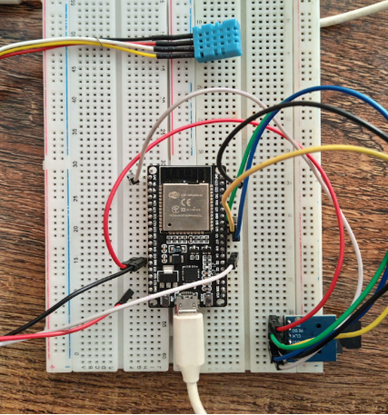
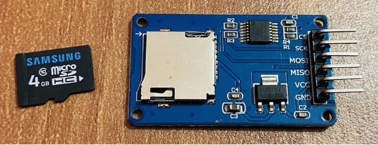
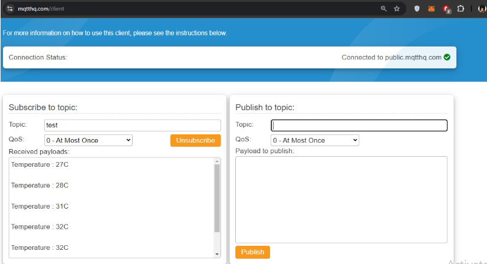
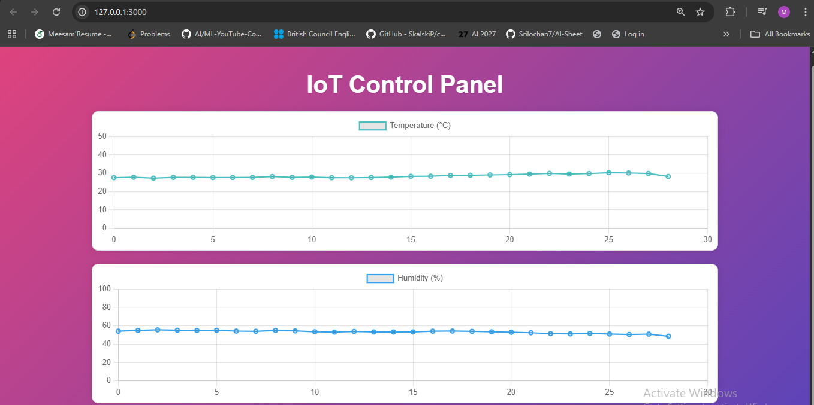

# 🌡️ Environmental Monitoring System (ESP32 + DHT11 + MQTT + SD Card)

This project implements a **low-power environmental monitoring system** that measures **temperature** and **humidity** using an ESP32 and a DHT11 sensor. The data is locally stored on an SD card and periodically transmitted over MQTT for real-time visualization in a Python-powered frontend.

---

## 📌 **Project Overview**

* Built a complete **IoT monitoring pipeline** for temperature and humidity.
* ESP32 reads **DHT11 sensor** values and:

  * Stores data on an **SD card** during deep-sleep intervals.
  * Publishes data to an **MQTT broker** every 10 minutes.
* A Python backend acts as an **MQTT subscriber**, receiving sensor values and serving them to a frontend dashboard.
* The dashboard visualizes **live temperature and humidity** readings using lightweight charts.

---

## ⚙️ **System Workflow**

### **1️⃣ Data Acquisition (ESP32 + DHT11)**

* ESP32 wakes from **deep sleep** every 10 minutes.
* Reads temperature & humidity from the DHT11 sensor.
* Logs the data to an SD card for backup.
* Publishes the data to an MQTT topic (e.g., `esp32/env/data`).

### **2️⃣ Data Transmission (MQTT Protocol)**

* MQTT ensures lightweight, fast, and reliable communication.
* Any device subscribed to the same topic can receive the data.

### **3️⃣ Data Processing (Python Subscriber)**

* A Python function subscribes to the MQTT topic.
* Whenever a new reading is published, the Python script receives it instantly.
* Data is forwarded to the frontend via simple Flask APIs.

### **4️⃣ Real-Time Frontend Dashboard**

* Values received through Flask are rendered on the webpage.
* Graphs update continuously to show:

  * Temperature trends
  * Humidity trends

---

## 🎯 **Use Cases**

* Remote environmental monitoring
* Agriculture and greenhouse analytics
* Smart home IoT systems
* Long-term weather tracking

